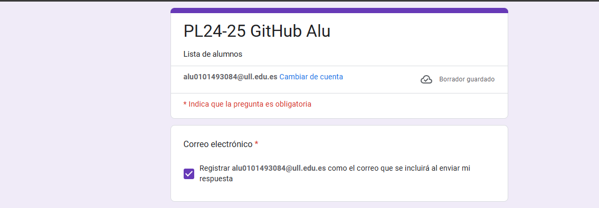
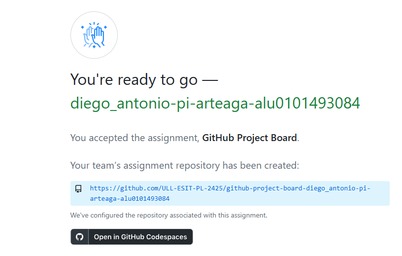
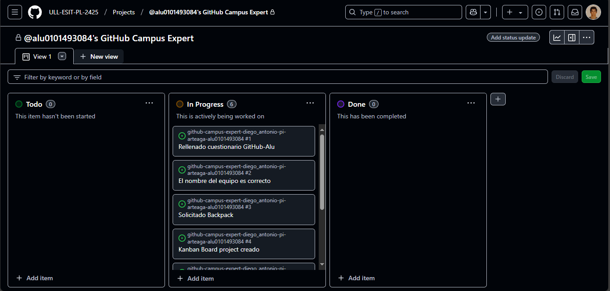
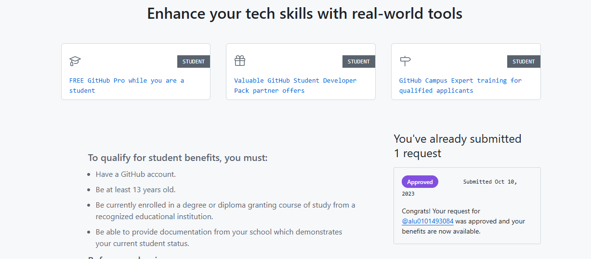
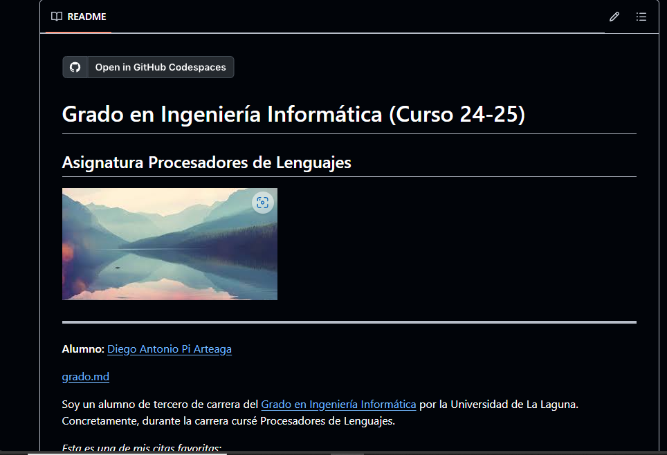

# Github Campus Expert 

- Diego Antonio 
- Apellidos 
- alu0101493084

## Rellenar el cuestionario GitHub-Alu del campus virtual

## Crear equipo con nombre correcto

## Crear un project board kanban para este repositorio

## Solicitar el GitHub Backpack

## Informe realizado mostrando que domina markdown de forma eficiente

